<!--
╔═══════════════════════════════════════════════════════════════════════════╗
║   D E V   P A R T H                                                       ║
║   agentic AI systems · engineer by discipline · poet by defect            ║
║                                                                           ║
║   "The machine does exactly what I say.                                   ║
║    That is the terror and the tenderness of it."                          ║
╚═══════════════════════════════════════════════════════════════════════════╝
-->

<div align="center">



<a href="https://github.com/Devparth7-coder">
  
</a>

<br/>

<a href="https://devparth.vercel.app"></a>
<a href="https://linkedin.com/in/dev-parth-360a68268274"></a>
<a href="mailto:devparth9784@gmail.com"></a>
<a href="https://github.com/Devparth7-coder?tab=repositories"></a>

<br/>


</div>

<br/>

```
────────────────────────────────────────────────────────────────────────────
                                                                      I. WHO
────────────────────────────────────────────────────────────────────────────
```

> *I keep two notebooks.*
> *One holds the stack traces. One holds the things I could not compile.*
> *Some nights I am not certain which one the machine is reading.*

**AI systems are distributed systems.** That sentence is most of my thesis.
Prompts, model calls, retrieval, tool invocations, approval gates, retries — they scatter across
provider consoles and vanish into logs nobody reads. I build the layer that refuses to let that
happen: control planes, trace graphs, evaluation harnesses, citation verifiers.

I write software the way I write verse — **strip it, sharpen it, let nothing stay that isn't load-bearing.**

```yaml
name:        Dev Parth
focus:       agentic AI systems · multi-agent orchestration · evaluation & observability
building:    FastAPI + Next.js control planes, LangGraph pipelines, RAG that cites itself
also:        Android (Kotlin · Compose) · interface design
researching: reliability of multi-agent systems (MAS-RELIAB)
principle:   deterministic by default, provider-agnostic by design
philosophy:  clarity over cleverness · restraint over ornament · traces over trust
```

<div align="center">

</div>

<br/>

```
────────────────────────────────────────────────────────────────────────────
                                                                     II. CRAFT
────────────────────────────────────────────────────────────────────────────
```

<div align="center">

**CORE**


**DATA · INFRA · RUNTIME**


**SURFACE**


</div>

<details>
<summary><b>&nbsp;Depth chart — what I actually reach for under pressure</b></summary>

<br/>

| Layer | Weapon of choice | Where it shows up |
| :--- | :--- | :--- |
| **Agent runtime** | LangGraph state machines, event-oriented execution, SSE streaming | Command Center, AURA |
| **Backend** | Python, FastAPI, Pydantic, async, durable event contracts | Every run persisted and replayable |
| **Retrieval** | Hybrid BM25 + dense, rerankers, Qdrant, sentence-transformers | Evidence engines that survive scrutiny |
| **Frontend** | Next.js 16, React 19, TypeScript, hand-rolled design systems | Operational UIs that don't look like dashboards |
| **Persistence** | PostgreSQL, SQLite, schema design with audit tables | Foreign keys are a moral position |
| **Evaluation** | Recall@k, MRR, faithfulness, citation validity, hallucination rate | Benchmark harnesses, ablation tables |
| **Safety** | AST allowlisting, sandboxed subprocesses, resource limits, approval gates | Code execution I can defend in a viva |
| **Mobile** | Kotlin, Jetpack Compose, MVVM, Coroutines, Room | The craft I started in |

**In the forge:** OpenTelemetry instrumentation · Compose Multiplatform · on-device inference · KMS-backed secret handling

</details>

<br/>

```
────────────────────────────────────────────────────────────────────────────
                                                                    III. WORK
────────────────────────────────────────────────────────────────────────────
```

###  &nbsp; AI Command Center

<a href="https://github.com/Devparth7-coder/Command-Centre"></a>


> **One interface. Every agent. Total control.**

A **local-first control plane** for creating, executing, observing and evaluating AI agents.
Not a chat wrapper — a full operational surface: persistent run history, clickable trace graphs,
span inspection, execution replay, model telemetry, memory governance, incident diagnosis and
human approval gates. Runs with **zero paid API keys** in Demo Mode, and the demo path is
*real* — actual HTTP, SQLite persistence and Server-Sent Events, not cosmetic loading timers.

```
Request → Intent → Plan → Agent selection → Tool call → Reasoning → Critic → Result
                                 │
   POST /api/runs ───────────────┴──── durable run record
   GET  /api/runs/{id}/events ───────── named SSE stream, atomically written
   GET  /api/runs/{id} ──────────────── reconstruct for trace + replay
```

| | |
| :--- | :--- |
| **Fleet overview** | live operational metrics, latency, token usage, estimated cost |
| **Ask Command Center** | streamed intent → planning → agent → tool → reasoning → critic stages |
| **Trace & replay** | clickable execution graph, span inspector, replay controls |
| **Workflow canvas** | versioned JSON graphs — add, configure, duplicate, export, run |
| **Memory governance** | semantic search, inline editing, deletion, entity graph |
| **Evaluation** | datasets separated from runs; raw judgments stored beside aggregates |

<sub>Provider adapters (OpenAI · Anthropic · Gemini) enable by env var. Secrets never enter model context.</sub>

<br/>

---

###  &nbsp; AURA — Autonomous Unified Research & Analysis

<a href="https://github.com/Devparth7-coder/AURA-Researcher"></a>


> **Ask a research question. Get a reproducible, fully-cited report.**

An **agentic research platform** that runs a question through a coordinated multi-agent pipeline —
planning, retrieval, evidence extraction, reasoning, sandboxed experimentation, critical verification
and evaluation. Output is a five-section report where **every claim carries a citation**.

```
START → plan → retrieve → evidence → reason → experiment → critique
      → (retry on failed claims) → evaluate → report → END
```

| Agent | Role |
| :--- | :--- |
| **Planner** | decomposes the question into entities, sub-questions, queries, facets, tasks |
| **Paper / Web / Data** | arXiv + Semantic Scholar + web + datasets, live APIs |
| **Evidence engine** | sentence-level hybrid search (BM25 + dense), rerank, citation binding |
| **Reasoning** | synthesizes citable claims and a comparison table |
| **Experiment** | sandboxed meta-analysis of reported metrics |
| **Critic** | verifies citation consistency and groundedness, bounded retry loop |
| **Evaluation** | retrieval + generation metrics, full benchmark harness |

**Zero API keys required** — deterministic synthesis, hashing embeddings, in-memory vector store.
Upgrades gracefully to hosted LLMs, sentence-transformers and Qdrant, all opt-in via `AURA_*` env vars.

```bash
python -m backend.cli --benchmark   # LLM-only vs RAG vs Hybrid-RAG vs AURA
```

<sub>The experiment sandbox combines AST import allowlisting, an isolated subprocess and OS resource limits — documented honestly as best-effort containment, not a hard security boundary.</sub>

<br/>

---

###  &nbsp; MAS-RELIAB — Research

<a href="https://github.com/Devparth7-coder/Research-paper"></a>


> **Can multi-agent systems improve citation correctness and evidence-grounded reasoning compared with conventional RAG?**

A complete **pre-experimental research manuscript** on multi-agent system reliability — appendices,
a locked Results shell, 45 viva questions with model answers, a timed defence script, and a
31-slide defence deck. Ships with results-ready templates: task schema, experiment manifest, results CSV.

**The part I'm proudest of:** no empirical run data has been supplied yet, so **every Results cell
contains an em dash and no hypothesis is reported as supported.** The scaffolding is built to be
filled from real, reproducible executions — not from wishful thinking. Methodology uses state-based
or executable ground truth wherever feasible, and deliberately keeps the Command Center
implementation separate from the MAS-RELIAB benchmark and analysis layer.

<sub>Research integrity is a design constraint, not a disclaimer.</sub>

<br/>

<div align="center">
<a href="https://github.com/Devparth7-coder?tab=repositories"></a>
</div>

<br/>

```
────────────────────────────────────────────────────────────────────────────
                                                                  IV. THE LOG
────────────────────────────────────────────────────────────────────────────
```

<div align="center">


</div>

<br/>

```
────────────────────────────────────────────────────────────────────────────
                                                                  V. THE VERSE
────────────────────────────────────────────────────────────────────────────
```

<div align="center">

<table>
<tr><td>

<br/>

**`nightly build`**

```
      Midnight. The fan admits it is trying.
      Forty tabs, one of them the reason.

      I ask the compiler what I meant
      and it answers in the only honest language left:

              error: expected expression

      So do I. So do I.
      I fix the semicolon. I do not fix the ache.
      The build goes green at 4 a.m.

      Somewhere a test passes that no one will ever read,
      and I call that a kind of prayer.
```

<br/>

</td></tr>
</table>

</div>

<details>
<summary align="center"><b>&nbsp;More from the notebook</b></summary>

<br/>

<div align="center">

**`the critic agent`**

```
      I built a thing whose only job
      is to read what the others wrote
      and ask, quietly, where did you get that.

      It fails them often.
      They try again. It fails them again.
      Two iterations, then it lets them through —
      not because they are right,
      but because I set the bound at two.

      Every system has a number
      where rigor stops and shipping starts.
      I have one too. I do not write it down.
```

<br/>

**`em dash`**

```
      The results table is full of them —
      one small horizontal line
      in every cell that wanted a number.

      I could have guessed. The shape of the guess
      was already sitting in my mouth.

      Instead I left the dashes standing,
      forty little doors held open,
      and went to bed honest.
```

<br/>

**`git blame`**

```
      Every line here has a name attached
      and every name was tired.

      Three years from now
      someone will run git blame on this function
      and find me at 2 a.m., certain,
      wrong, and shipping anyway.

      Be kind to them. They were doing their best.
      Be kind to me. I am them.
```

<br/>

**`null`**

```
      The cleanest thing I ever wrote was nothing —
      an empty return, a quiet default,
      the grace of a function that knows
      when not to answer.
```

</div>

</details>

<br/>

```
────────────────────────────────────────────────────────────────────────────
                                                                VI. TRAJECTORY
────────────────────────────────────────────────────────────────────────────
```

| Era | What happened |
| :--- | :--- |
| **2023** | First `Hello, World!`. First repository. First all-nighter that felt like a calling. |
| **2024** | Web fundamentals, then AI/ML. First hackathon. Learned that shipping beats theorizing. |
| **2025** | Android specialization — Kotlin, Compose, architecture. Design became non-negotiable. |
| **2026** | Turned toward agentic systems. Built **AURA** and **AI Command Center**. Wrote **MAS-RELIAB**. |
| **2027** | Empirical results. A platform with users who are not me. |
| **2028** | Graduate as a CS engineer — with a company already breathing. |

<br/>

```
────────────────────────────────────────────────────────────────────────────
                                                                  VII. CONTACT
────────────────────────────────────────────────────────────────────────────
```

<div align="center">

**If you're building something difficult, I want to hear about it.**

<a href="mailto:devparth9784@gmail.com"></a>
<a href="https://linkedin.com/in/dev-parth-360a68268274"></a>
<a href="https://devparth.vercel.app"></a>
<a href="https://github.com/sponsors/Devparth7-coder"></a>

<br/><br/>

<samp>Write code that reads like a sentence. Write sentences that run.</samp>

<br/>


</div>

<!--
  IMAGE POLICY FOR THIS README
  ────────────────────────────
  Banner, pipeline and footer are self-hosted SVGs in ./assets — they render from
  this repo and cannot be taken down by a third-party outage.

  Deliberately NOT used (verified dead on 2026-08-17):
    · github-readme-stats.vercel.app   → 503 DEPLOYMENT_PAUSED
    · github-profile-trophy.vercel.app → 402 DEPLOYMENT_DISABLED
    · capsule-render.vercel.app        → serves text/html, GitHub camo won't proxy it
  If you ever re-add them, curl the URL first and confirm content-type is image/svg+xml.

  The contribution snake needs .github/workflows/snake.yml to run once and create
  the 'output' branch. Until then its URL is a 404, so it is not embedded here.
-->
