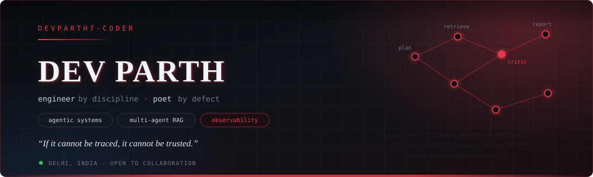
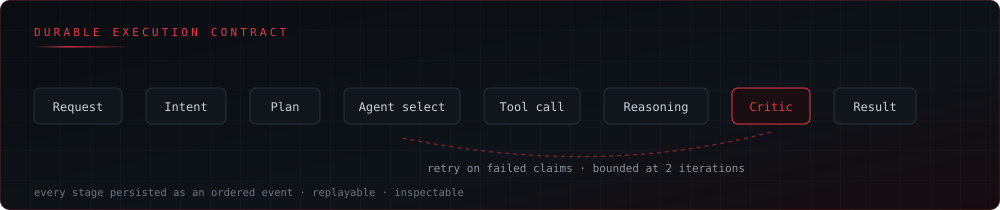

<!--
╔═══════════════════════════════════════════════════════════════════════════╗
║   D E V   P A R T H                                                       ║
║   agentic AI systems · engineer by discipline · poet by defect            ║
║                                                                           ║
║   "The machine does exactly what I say.                                   ║
║    That is the terror and the tenderness of it."                          ║
╚═══════════════════════════════════════════════════════════════════════════╝

  Revision — 30 Sep 2026
  Feature set re-ranked after auditing all 84 public repositories.
  Ranking rule: what actually runs (tests, CI, live deploys, measured numbers)
  beats what is merely newest. Three repositories changed the order:
  AgentLab, PRISM, VayuSutra-V4.
-->

<div align="center">



<a href="https://github.com/Devparth7-coder">
  
</a>

<br/>

<a href="https://devparth7-coder.github.io/dev-parth-portfolio/"></a>
<a href="https://linkedin.com/in/dev-parth-4b6766392"></a>
<a href="https://codeforces.com/profile/dparth_7"></a>
<a href="https://www.codechef.com/users/true_field_64"></a>
<a href="mailto:devparth9784@gmail.com"></a>
<a href="https://github.com/Devparth7-coder?tab=repositories"></a>

<br/>


</div>

<br/>

```
────────────────────────────────────────────────────────────────────────────
                                                                      I. WHO
────────────────────────────────────────────────────────────────────────────
```

> *I keep two notebooks.*
> *One holds the stack traces. One holds the things I could not compile.*
> *Some nights I am not certain which one the machine is reading.*

**AI systems are distributed systems.** That sentence is most of my thesis.
Prompts, model calls, retrieval, tool invocations, approval gates, retries — they scatter across
provider consoles and vanish into logs nobody reads. I build the layer that refuses to let that
happen: control planes, trace graphs, evaluation harnesses, citation verifiers.

I write software the way I write verse — **strip it, sharpen it, let nothing stay that isn't load-bearing.**

```yaml
name:        Dev Parth
role:        CSE undergraduate (2024–2028) · builder · researcher
focus:       agentic AI systems · multi-agent orchestration · evaluation & observability
building:    AgentLab (agent reliability workbench) · PRISM (PR review mesh) · VayuSutra (SIH 2026)
also:        Android (Kotlin · Compose) · interface design · competitive programming
researching: reliability of multi-agent systems (MAS-RELIAB)
principle:   deterministic by default, provider-agnostic by design
philosophy:  clarity over cleverness · restraint over ornament · traces over trust
```

<div align="center">

</div>

<br/>

```
────────────────────────────────────────────────────────────────────────────
                                                                     II. CRAFT
────────────────────────────────────────────────────────────────────────────
```

<div align="center">

**CORE**


**DATA · INFRA · RUNTIME**


**SURFACE**


</div>

<details>
<summary><b>&nbsp;Depth chart — what I actually reach for under pressure</b></summary>

<br/>

| Layer | Weapon of choice | Where it shows up |
| :--- | :--- | :--- |
| **Agent runtime** | LangGraph state machines, event-oriented execution, SSE streaming | AURA, AURA-EVAL, AgentLab |
| **Backend** | Python, FastAPI, Pydantic, async, durable event contracts | Every run persisted and replayable |
| **Retrieval** | Hybrid BM25 + dense, rerankers, Qdrant, sentence-transformers | AURA, OMNIVISTA, SatQuery evidence engines |
| **Frontend** | Next.js 16, React 19, TypeScript, hand-rolled design systems | AgentLab, Command Center, PRISM |
| **Persistence** | PostgreSQL, Prisma, SQLite, schema design with audit tables | Foreign keys are a moral position |
| **Evaluation** | Wilson intervals, paired regression deltas, recall@k, MRR, faithfulness, citation validity | AgentLab, SLM-FORGE, MAS-RELIAB |
| **Judge & sandboxing** | Docker and rlimit+netns supervisors, AST allowlisting, queue workers, per-test verdicts | CODEARENA, AURA experiment sandbox |
| **Mobile** | Kotlin, Jetpack Compose, MVVM, Coroutines, Room | The craft I started in |

**In the forge:** OpenTelemetry instrumentation · code-graph context engines · Compose Multiplatform · on-device inference

</details>

<br/>

<div align="center">

**PROBLEM SOLVING**

<a href="https://codeforces.com/profile/dparth_7"></a>
<a href="https://codeforces.com/profile/dparth_7"></a>
<a href="https://www.codechef.com/users/true_field_64"></a>

<sub>Candidate Master on Codeforces (peak Master) · 5★ Division 1 on CodeChef — the part of this profile that predates the AI work, and still the reason the AI work has decent complexity bounds.</sub>

</div>

<br/>

```
────────────────────────────────────────────────────────────────────────────
                                                                    III. WORK
────────────────────────────────────────────────────────────────────────────
```

<sub>Ranked by what actually runs — tests, CI, live deploys, measured numbers — not by what is newest.</sub>

<br/>

###  &nbsp; AgentLab — Agent Reliability Workbench

<a href="https://github.com/Devparth7-coder/AgentLab"></a>


> **Test. Observe. Break. Improve.**

An **evidence-first workbench for AI-agent reliability**: immutable agent and benchmark versions,
asynchronous task-level evaluation, observable traces, failure replay, seeded robustness probes,
**paired regression analysis**, measured cost and latency, and report snapshots that export to PDF —
every metric carrying its formula, sample count, source, timestamp, agent version, benchmark version
and experiment provenance.

| Surface | What it actually does |
| :--- | :--- |
| **Registry** | Immutable agent versions (provider, model, revision, prompt hash, tool allowlist, config hash) and immutable benchmarks with reference answers and evaluator rules |
| **Evidence** | Redacted observable input/output metadata, sandboxed tool calls, evaluator evidence, conditional replay outcomes — **no private chain-of-thought** |
| **Measurement** | Explicit denominators, multi-run Wilson intervals, provider-reported tokens, configured-price estimates, wall-clock percentiles. **Null ≠ zero** |
| **Research loop** | Seeded robustness variants → comparable paired deltas → new-failure links → frozen JSON/Markdown/HTML reports |

<sub>This is the repository where the profile's thesis became software: the README's first rule is *no convincing-looking invented scores*. Missing usage reads **Not measured**; unstarted work reads **Pending evaluation**; the demo fixture is labelled **DEMO / SYNTHETIC** rather than passed off as model capability.</sub>

<br/>

---

###  &nbsp; AI Command Center

<a href="https://github.com/Devparth7-coder/Command-Centre"></a>


> **One interface. Every agent. Total control.**

A **local-first control plane** for creating, executing, observing and evaluating AI agents.
Not a chat wrapper — a full operational surface: persistent run history, clickable trace graphs,
span inspection, execution replay, model telemetry, memory governance, incident diagnosis and
human approval gates. Runs with **zero paid API keys** in Demo Mode, and the demo path is
*real* — actual HTTP, SQLite persistence and Server-Sent Events, not cosmetic loading timers.

```
Request → Intent → Plan → Agent selection → Tool call → Reasoning → Critic → Result
                                 │
   POST /api/runs ───────────────┴──── durable run record
   GET  /api/runs/{id}/events ───────── named SSE stream, atomically written
   GET  /api/runs/{id} ──────────────── reconstruct for trace + replay
```

| | |
| :--- | :--- |
| **Fleet overview** | live operational metrics, latency, token usage, estimated cost |
| **Ask Command Center** | streamed intent → planning → agent → tool → reasoning → critic stages |
| **Trace & replay** | clickable execution graph, span inspector, replay controls |
| **Workflow canvas** | versioned JSON graphs — add, configure, duplicate, export, run |
| **Memory governance** | semantic search, inline editing, deletion, entity graph |
| **Evaluation** | datasets separated from runs; raw judgments stored beside aggregates |

<sub>The most-starred repository here, and the one where the whole thesis started. Provider adapters (OpenAI · Anthropic · Gemini) enable by env var; secrets never enter model context.</sub>

<br/>

---

###  &nbsp; VayuSutra — National Airfare Intelligence

<a href="https://github.com/Devparth7-coder/VayuSutra-V4"></a>
<a href="https://v4-alpha-ashen.vercel.app"></a>


> **Measure · Explain · Forecast · Simulate.**

Smart India Hackathon 2026 solution for **MoSPI (Problem SIH26056)** — a quantitative econometric
platform that replaces India's 30-day manual airport-counter fare collection with a high-frequency
pipeline: ingest real online fares, **de-bias across OTAs**, compute statutory price indices
(Jevons elementary, Laspeyres, superlative Fisher), nowcast inflation, simulate policy shocks, and
score the trustworthiness of every input.

```
1. WHAT HAPPENED?     →  real-time index across OTA de-biased listings
2. CAN WE TRUST IT?   →  Data Trust Center scorecard (freshness · coverage · provenance)
3. WHY DID IT HAPPEN? →  CPI decomposition waterfall + market anomaly engine
4. WHAT COMES NEXT?   →  nowcasting ensemble, then RBI-rate policy simulation
```

Designed and built end-to-end by me — architecture, econometric math, ingestion, API surface, and UI —
against a brief whose stated beneficiaries are the **NSO, the RBI Monetary Policy Committee and the DGCA**.

<sub>Opinionated where it matters: the index math is the product, so every displayed figure traces back to a stored observation rather than to a model's opinion.</sub>

<br/>

---

###  &nbsp; PRISM — Pull Request Intelligence & Review Mesh

<a href="https://github.com/Devparth7-coder/PRISM"></a>


> **AI code review that understands your repository.** Deterministic analysis first, specialised
> agents second, an adversarial critic third — every finding ships with an evidence chain.

A diff is not the whole story. PRISM ingests the pull request **and the repository context around
it** — callers, services, database access, tests, conventions — runs a deterministic rules engine,
secret scanner and dependency advisory check *before any model is called*, then dispatches
specialised review agents whose HIGH/CRITICAL findings are independently challenged
(`CONFIRMED` · `WEAK` · `FALSE POSITIVE` · `UNCERTAIN`) and folded into one explainable risk score.

```
Changed code → related code → repository context → deterministic evidence
            → AI analysis → critic verification → recommendation
```

**Real demo runs, not screenshots:** the bundled review of a 6-defect Express PR scores
**63/100 HIGH → REQUEST CHANGES** with 13 findings (including a genuine SQL injection flagged by
rules, confirmed by the critic); after the author's fix the same PR re-reviews at
**3/100 LOW → APPROVE**, 13 fixed, 0 persistent, 0 new. Deterministic reviews finish in tens of
milliseconds with **zero LLM tokens**.

<sub>Honest by construction: PRISM never executes pull-request code, unconfigured providers are labelled DEMO MODE, model output is validated as structured JSON, and secrets are redacted from logs. Re-review diffs findings by fingerprint instead of re-judging from scratch.</sub>

<br/>

---

###  &nbsp; SatQuery AI — Ask the Pixels, Not the Model

<a href="https://github.com/Devparth7-coder/SatQuery-AI"></a>


> **Ask a satellite image a question. Get answers measured from the pixels.**

Upload a scene, ask in plain English, and get an answer with **visual proof, methodology,
uncertainty and an auditable evidence trail** — because Earth-observation answers must be
*measured, not generated*.

```
"How much of the area is water?"      → 58.8% · 62.9 km² + highlighted water mask
"How many ships are there?"           → 49 vessels + ringed detections + lengths
"What is the NDVI here?"              → honest unavailable state on RGB-only input
"What changed between the two dates?" → 3.67% changed · severity MEDIUM + hotspots
```

Sensor-aware band mapping · spectral engine (NDVI/NDWI/SAVI/EVI/GNDVI/…) · land-cover intelligence
with a transparent quality label · object and linear-structure detection · bi-temporal change
(ORB/RANSAC registration, CVA+Otsu, transition matrix) · map workspace with pixel inspector and
before/after slider · query planner that emits `QUERY → INTERPRETATION → TOOLS → EVIDENCE → ANSWER`.

<sub>Deterministic remote-sensing code is the <b>only</b> source of numbers here; language only plans, interprets and explains. If the bands can't support an index, the answer says so instead of estimating. Every answer resolves to <code>E#</code> evidence items with method, value and confidence.</sub>

<br/>

---

###  &nbsp; DevUnity CodeArena

<a href="https://github.com/Devparth7-coder/CODEARENA"></a>
<a href="https://codearena-nu-six.vercel.app"></a>


> **Where developers don't just write code. They enter the arena.**

A production-grade competitive-programming platform: problem authoring with hidden tests and
validation gates, a **sandboxed multi-language judge** (Docker, or an rlimit+netns supervisor),
contests with server-authoritative timing and frozen standings, virtual participation, an auditable
Elo system, college rankings, profiles, discussions and an admin control center.

| Piece | Detail |
| :--- | :--- |
| **Judge** | PostgreSQL queue with `SKIP LOCKED` (no Redis needed) → worker → sandbox supervisor → per-test verdicts with real measured time and peak RSS |
| **Verdicts** | `accepted · wa · tle · mle · re · ce · internal_error` — every class exercised by a real smoke run |
| **Proof** | 84 end-to-end acceptance checks, route-level web smoke against a live API, unit + integration suites, one-click Render blueprint |

<sub>Standings, ratings, acceptance rates and timings are computed from the database at request time — if the judge hasn't measured it, the UI renders an em dash.</sub>

<br/>

<div align="center">
<a href="https://github.com/Devparth7-coder?tab=repositories"></a>
</div>

<br/>

```
────────────────────────────────────────────────────────────────────────────
                                                              IV. THE BENCH
────────────────────────────────────────────────────────────────────────────
```

<sub>Shipped, tested, and worth a click — just not the first thing I want you to read.</sub>

| Project | Stack | Why it's on the bench |
| :--- | :--- | :--- |
| **[AURA-Researcher](https://github.com/Devparth7-coder/AURA-Researcher)** | Python · LangGraph · hybrid RAG | Where the thesis started: a planning → retrieval → evidence → reasoning → sandboxed experiment → critique → report pipeline where **every claim carries a citation** — and runs with zero API keys. [Live ↗](https://aura-researcher.onrender.com/) |
| **[NEXUS SERVE](https://github.com/Devparth7-coder/nexus-server)** | TypeScript · Prisma · ONNX | A model-serving engine: model registry with checksums, sync + async inference, dynamic batching, real FP32→FP16/INT8 quantization, GPU memory admission control, P50–P99 benchmarks, Prometheus metrics. |
| **[NEXUS](https://github.com/Devparth7-coder/NEX)** | TypeScript | An agentic OS with a dynamic mission graph, permissioned tool gateway, self-correction on its own test regressions, and an explicit approval gate before the pull request. [Live ↗](https://nex-fawn.vercel.app) |
| **[SLM-FORGE](https://github.com/Devparth7-coder/slm-forge)** | Python · LoRA/QLoRA | A fine-tuning laboratory that refuses to let a base model and a tuned model see different test sets. Every number traced to experiment ID, dataset hash, seed and git commit. |
| **[AURA-EVAL](https://github.com/Devparth7-coder/AURA-EVAL)** | Python · LangGraph · Next.js | Six agents that plan → generate → judge → refine → approve synthetic training data, with reliability analytics and human-in-the-loop review. Ships a deterministic mock provider, so the whole product runs offline. |
| **[BLACKBOX](https://github.com/Devparth7-coder/Black-Box)** | Python | Treats an LLM as an unknown system and probes it: stress, paraphrase drift, long-context decay, tool failure, distribution shift. No marketing copy, just behaviour under pressure. |
| **[telco-churn-ml-system](https://github.com/Devparth7-coder/telco-churn-ml-system)** | Python · FastAPI | Checksum-pinned ingestion → leakage-safe preprocessing → Optuna tuning → hardened API with PSI drift monitoring. Measured **F1 0.6405** on a held-out set, plus two screen recordings of the live service. |
| **[OMNIVISTA AI](https://github.com/Devparth7-coder/OMNIVISTA-AI)** | Python | Multimodal RAG that reads tables, charts and diagrams, then cites answers down to the **page and region**. Runnable end-to-end with no keys. |
| **[FRAMEFORGE](https://github.com/Devparth7-coder/FrameForge)** | Python · FastAPI | Narrative → storyboard, engineered around the part everyone skips: character consistency across scenes, validated before a frame joins the storyboard. |
| **[APEX-STEWARD-AI](https://github.com/Devparth7-coder/APEX-STEWARD-AI)** | React · FastAPI · OpenCV | Motorsport decision support that links visual evidence, track boundaries and a human review step. [Live ↗](https://track-shift-innovation-challenge.vercel.app) |
| **[DUCA](https://github.com/Devparth7-coder/DUCA)** | JavaScript | The earlier cut of the arena: contests, ICPC-style standings, college rankings, Monaco editor, sandboxed judge. Kept because the sequel is only interesting with the first draft visible. |
| **[ShortForge](https://github.com/Devparth7-coder/ShortForge)** | Python · Flask · FFmpeg | Topic → narrated, captioned, music-bedded 9:16 short. Works with no API keys at all. [Live ↗](https://shortforge-2.onrender.com/) |

<br/>

```
────────────────────────────────────────────────────────────────────────────
                                                                V. RESEARCH
────────────────────────────────────────────────────────────────────────────
```

### MAS-RELIAB — Research

<a href="https://github.com/Devparth7-coder/Research-paper"></a>


> **Can multi-agent systems improve citation correctness and evidence-grounded reasoning compared with conventional RAG?**

A complete **pre-experimental research manuscript** on multi-agent system reliability — appendices,
a locked Results shell, 45 viva questions with model answers, a timed defence script, and a
31-slide defence deck. Ships with results-ready templates: task schema, experiment manifest, results CSV.

**The part I'm proudest of:** no empirical run data has been supplied yet, so **every Results cell
contains an em dash and no hypothesis is reported as supported.** The scaffolding is built to be
filled from real, reproducible executions — not from wishful thinking. Methodology uses state-based
or executable ground truth wherever feasible, and deliberately keeps the implementation separate
from the benchmark and analysis layer.

<sub>Research integrity is a design constraint, not a disclaimer.</sub>

<br/>

| Thread | Repo | Angle |
| :--- | :--- | :--- |
| **Failure propagation in multi-agent systems** | [Research-paper](https://github.com/Devparth7-coder/Research-paper) | Fault injection across topologies, trace-based attribution, reliability–cost trade-offs |
| **Does fine-tuning actually help?** | [slm-forge](https://github.com/Devparth7-coder/slm-forge) | Identical held-out set and harness for base and tuned model; bootstrap intervals; H0/H1 left open until the data says otherwise |
| **How do models behave under pressure?** | [Black-Box](https://github.com/Devparth7-coder/Black-Box) | Empirical probing of LLMs as unknown systems instead of trusting their self-description |

<br/>

```
────────────────────────────────────────────────────────────────────────────
                                                                  VI. THE LOG
────────────────────────────────────────────────────────────────────────────
```

<div align="center">


</div>

<br/>

```
────────────────────────────────────────────────────────────────────────────
                                                                VII. THE VERSE
────────────────────────────────────────────────────────────────────────────
```

<div align="center">

<table>
<tr><td>

<br/>

**`nightly build`**

```
      Midnight. The fan admits it is trying.
      Forty tabs, one of them the reason.

      I ask the compiler what I meant
      and it answers in the only honest language left:

              error: expected expression

      So do I. So do I.
      I fix the semicolon. I do not fix the ache.
      The build goes green at 4 a.m.

      Somewhere a test passes that no one will ever read,
      and I call that a kind of prayer.
```

<br/>

</td></tr>
</table>

</div>

<details>
<summary align="center"><b>&nbsp;More from the notebook</b></summary>

<br/>

<div align="center">

**`the critic agent`**

```
      I built a thing whose only job
      is to read what the others wrote
      and ask, quietly, where did you get that.

      It fails them often.
      They try again. It fails them again.
      Two iterations, then it lets them through —
      not because they are right,
      but because I set the bound at two.

      Every system has a number
      where rigor stops and shipping starts.
      I have one too. I do not write it down.
```

<br/>

**`em dash`**

```
      The results table is full of them —
      one small horizontal line
      in every cell that wanted a number.

      I could have guessed. The shape of the guess
      was already sitting in my mouth.

      Instead I left the dashes standing,
      forty little doors held open,
      and went to bed honest.
```

<br/>

**`git blame`**

```
      Every line here has a name attached
      and every name was tired.

      Three years from now
      someone will run git blame on this function
      and find me at 2 a.m., certain,
      wrong, and shipping anyway.

      Be kind to them. They were doing their best.
      Be kind to me. I am them.
```

<br/>

**`null`**

```
      The cleanest thing I ever wrote was nothing —
      an empty return, a quiet default,
      the grace of a function that knows
      when not to answer.
```

</div>

</details>

<br/>

```
────────────────────────────────────────────────────────────────────────────
                                                            VIII. TRAJECTORY
────────────────────────────────────────────────────────────────────────────
```

| Era | What happened |
| :--- | :--- |
| **2023** | First `Hello, World!`. First repository. First all-nighter that felt like a calling. |
| **2024** | Web fundamentals, then AI/ML. First hackathon. Started the CSE degree at MMMUT. |
| **2025** | Android specialization — Kotlin, Compose, architecture. Design became non-negotiable. |
| **2026** | Turned toward agentic systems. **AURA**, then **AI Command Center**; **AgentLab** to prove the numbers; **VayuSutra** for MoSPI at SIH; **PRISM** and **SatQuery** to test the thesis outside my own domain. Codeforces Candidate Master. Wrote **MAS-RELIAB**. |
| **2027** | Empirical results. A platform with users who are not me. |
| **2028** | Graduate as a CS engineer — with a company already breathing. |

<br/>

```
────────────────────────────────────────────────────────────────────────────
                                                                 IX. CONTACT
────────────────────────────────────────────────────────────────────────────
```

<div align="center">

**If you're building something difficult, I want to hear about it.**

<a href="mailto:devparth9784@gmail.com"></a>
<a href="https://linkedin.com/in/dev-parth-4b6766392"></a>
<a href="https://devparth7-coder.github.io/dev-parth-portfolio/"></a>
<a href="https://codeforces.com/profile/dparth_7"></a>
<a href="https://github.com/sponsors/Devparth7-coder"></a>

<br/><br/>

<samp>Write code that reads like a sentence. Write sentences that run.</samp>

<br/>


</div>

<!--
  IMAGE POLICY FOR THIS README
  ────────────────────────────
  Banner, pipeline and footer are self-hosted SVGs in this repo — they render from
  here and cannot be taken down by a third-party outage.

  Deliberately NOT used (re-verified 2026-09-30):
    · github-readme-stats.vercel.app    → 503 DEPLOYMENT_PAUSED
    · github-profile-trophy.vercel.app  → 402 DEPLOYMENT_DISABLED
    · github-readme-activity-graph.vercel.app → 402 (removed from this revision)
    · capsule-render.vercel.app         → serves text/html, GitHub camo won't proxy it
    · prism-review.vercel.app           → unrelated project, do not link
  Live every URL/asset in this file before re-adding it; confirm content-type is image/svg+xml.

  Verified live on 2026-09-30: profile-summary-cards, streak-stats, ghchart, skillicons,
  readme-typing-svg, shields.io (including dynamic JSON badges against the Codeforces API),
  dev-parth-portfolio (GitHub Pages), aura-researcher.onrender.com, shortforge-2.onrender.com,
  nex-fawn.vercel.app, v4-alpha-ashen.vercel.app, codearena-nu-six.vercel.app.

  The contribution snake needs .github/workflows/snake.yml to run once and create
  the 'output' branch. Until then its URL is a 404, so it is not embedded here.
-->
